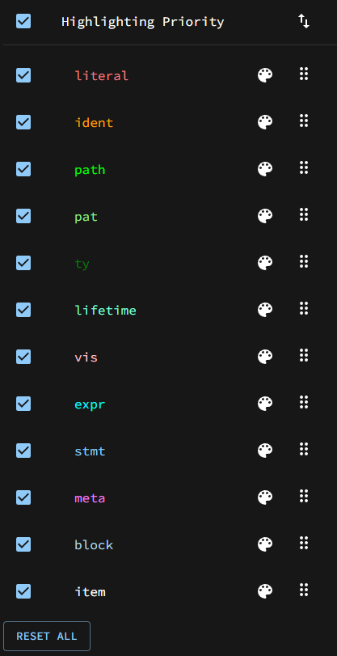
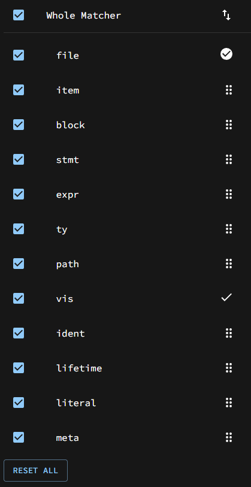

# :artist_palette: Rust フラグメント指定子判別器 Fragment Specifiers Highlighter :artist_palette:

`ident` , `literal` , `ty` ...などなどのフラグメント指定子でRustコードを着色します！

## フラグメント指定子一覧

| フラグメント指定子 | 例 | 説明 |
|:---------------|:---|:-----|
| `ident` | `hoge`, `self` | 変数名や関数名などの識別子全般 |
| `expr` | `10 + 20`, `funcall()`, `if a { b } else { c }` | 式。いわゆる評価後に値を返す何か |
| `literal` | `10`, `"hoge"`, `true` | リテラル。ソースコード内で直接表現される固有値 |
| `stmt` | `let a = 10;`, `struct Hoge;`, `fn foo() {}` | ステートメント。文 |
| `ty` | `i32`, `&'a str`, `fn() -> ()` | 型 |
| `path` | `std::option::Option`, `Turbo::<Fish>`, `::std::println` | パス |
| `block` | `{}` | スコープを作り出す中括弧を含めた全体 |
| `item` | `pub fn foo() {}`, `use std::fs;`, `impl Hoge {}` | use文や関数宣言など |
| `pat` / `pat_param` | `Some(ref hoge)`, `None`, `0..10` | パターンマッチとして使用できる構造 |
| `lifetime` | `'a`, `'static`, `'_` | ライフタイム |
| `meta` | `derive(Debug)`, `path = "hoge"`, `serde` | 属性風マクロ等のアトリビュート(属性) |
| `vis` | `pub`, `pub(crate)` | 可視性 |
||||
| `tt` || トークン木 (Token Tree) 。 **本アプリでは判別できません。** |

## 使い方

基本的にはテキストフォールドにRustコードを入力するだけです。以下は細かい設定について解説します。

### Highlighting Priority

フラグメント指定子着色の優先順位を決定するカラムです。

- チェックボックスにチェックが入っているフラグメント指定子のみがハイライトされます。
- 上にある指定子ほど他の指定子の色を上書きします。順番は一番右にあるハンドルをD&Dすることで変えられます。
- カラーパレットアイコン :artist_palette: から、ハイライト色の変更や背景色でのハイライトへの変更が可能です。

思うようなハイライトにならなかった時はチェックボックスを外したり順番を変えてみたりしてほしいです。

### Whole Matcher

与えられたRustコード片 **全体** について、何であると解釈してパースするかを決定します。

- `file` はRustコード全体がファイルであると仮定してのパースです。 `file` はフラグメント指定子ではありません。
- チェックボックスにチェックが入っている構文でのみ、パースを試みます。
- 上にある構文からマッチを試みていきます。最初にマッチした構文での結果が表示され、その構文には右に丸チェックがつきます。順番は一番右にあるハンドルをD&Dすることで変えられます。
  - マッチした構文はパース結果上部にも `Whole Match: xxx` という形で示されています。
- その他にパースに成功した構文についても、右にチェックがつきます。

Whole Matcherはコード片全体のフラグメント指定子を確認したい場合に便利です。思うようにコード片が解釈されない時はこちらの順番も調整してみてください。

### その他のTIPS

- 上の方にライトモード/ダークモード切り替えがあるので見やすい方を使ってください。
- Highlighting Priority、Whole Matcherともにカラムタイトルの横のチェックボックスで全体の有効/無効を切り替えられ、一番下にあるボタンで初期状態に戻せます。
- フラグメント指定子の表にも書きましたが、 **フラグメント指定子には `tt` がある一方、本アプリでは確認するすべがありません。** これは内部で使用しているsynクレートとの兼ね合いの問題もあるのですが、そもそも **`tt` はワイルドカード** なのでマッチするしないは関係ないのです...ないのです。

## さらなる詳細

本アプリ作成の背景等は次の記事を参考にしていただけると幸いです！

[Rustマクロ フラグメント指定子(ident, expr, item, stmt...)なんもわからん！となったので判別器作った #Rust - Qiita](https://qiita.com/namn1125/items/93461ddf93277b79a96f)